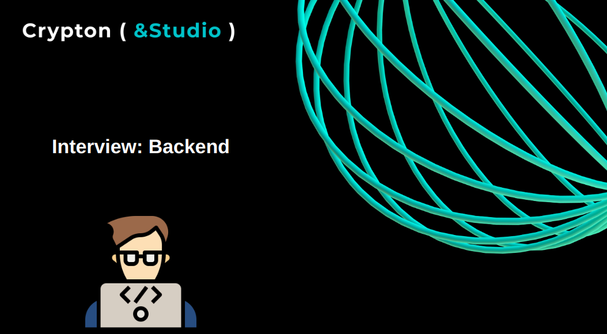

  
  <h1>Вопросы и ответы для собеседования Back-end разработчика</h1>

## Содержание

### 1. [Операционные системы](./docs/os/README.md)

#### Middle
- Какие инструменты предоставляются для мониторинга и управления ресурсами в Linux?
- Что такое ротация журналов системных служб?
- Что такое systemd и systemctl?
- Как можно настроить лимиты ресурсов для системных служб с помощью systemd?
- Как можно настроить выполнение той или иной задачи переодически по времени?
- Какие процессы и сервисы запускаются при загрузке Linux?
#### Middle +
- Как устроено ядро linux?
- Какие средства управления пакетами используются в Linux?
- Какие основные компоненты входят в операционную систему Linux?
- Что такое виртуальная память в Linux и как она работает?
- Как Linux обеспечивает многозадачность и многопоточность?
- Как настроить безопасность в Linux с помощью прав доступа (permissions) и атрибутов файлов?
- Какие механизмы обеспечивают безопасность в Linux?

### 2. [Основы сетей и сетевых протоколов](./docs/networks/README.md)

##### Junior

- Что такое протокол TCP/IP и какие он состоит из уровней?
- Что такое протокол TCP и в чем заключается его основная функция?
- Как работает управление потоком в TCP?
- Что такое протокол UDP и в каких случаях его лучше использовать, чем TCP?
- В чем заключается разница между TCP и UDP?
- Что такое HTTP и какие методы запросов оно поддерживает?
- Какие основные статусы ответов HTTP вы знаете и что они означают?
- Что такое RESTful API и какие принципы оно включает?

#### middle

- Что такое IP-адрес и какие типы IP-адресов существуют?
- В чем разница между IPv4 и IPv6?
- Какие протоколы используются для передачи электронной почты и веб-серверов?
- В чем разница между HTTP и HTTPS?
- Что такое атака типа Man-in-the-Middle (MITM) и как ее предотвратить?
- Как работает шифрование SSL/TLS и зачем оно нужно?

### 3. [Чистый код](./docs/clean-code/README.md)

#### Junior
- Что такое чистый код и почему он важен для разработки программного обеспечения?
- Какие инструменты и техники вы используете для обеспечения чистоты кода в своем проекте?
- Какие основные принципы чистого кода вы знаете?
- Что такое SOLID и что значат его принципы?
- Что такое DRY принцип (Don't Repeat Yourself) и почему его важно соблюдать?

#### Middle

- Что такое KISS?
- Что значит правельное именование переменных, функций, классов и других структур и почему важно выбирать осмысленные имена?
- Какие антипаттерны и непродуктивные практики есть при организации кода?
- Что такое "чистая архитектура" и как она связана с чистым кодом?
- Как вы оцениваете качество своего кода и какие метрики используете для этого?
- Какие методы вы применяете для оценки и снижения технического долга?
- Как должны выглядеть коментарии для обеспечения чистоты и понятности кода?

### 4. [GIT](./docs/git/README.md)

#### Junior

- Что такое Git и для чего он используется?
- Как откатить изменения в репозитории Git?
- Как объединить изменения из одной ветки в другую в Git?
- Что такое rebase и в чем разница между reset и rebase в Git?

#### Middle

- Как создать и применить тег (tag) к коммиту в Git и для чего он нужен?
- Что такое stash и для чего он используется?
- Как изменить последний коммит в Git?
- Как выполнить переименование и перемещение файлов в Git без потери истории?

### 5. [Базы данных](./docs/database/README.md)

#### Junior

- Какие типы баз данных вы знаете?
- В чем разница между реляционными и нереляционными базами данных?
- Что такое SQL и для чего он используется?
- Что такое принципы ACID и как они связаны с базами данных?
- Что такое индекс в базе данных и зачем он нужен?
- Какие типы индексов вы знаете, и в чем их различия?
- Что такое транзакция в контексте базы данных, и какие свойства она должна обладать?
- Что такое нормализация базы данных и какие преимущества она предоставляет?
- Что такое денормализация базы данных и какие преимущества она предоставляет?

#### Middle

- Как работает механизм сегментации таблиц?
- В чем разница между внешними и внутренними ключами в реляционной базе данных?
- Какие методы резервного копирования и восстановления данных вы знаете?
- Какие особенности хранения и обработки JSON данных в PostgreSQL?
- Какие механизмы обеспечения безопасности данных предоставляет PostgreSQL?
- Что такое триггеры и как они используются в PostgreSQL для автоматизации действий при изменении данных?
- Какие инструменты и технологии используются для масштабирования баз данных и обеспечения их высокой доступности?
- В чем отличие синхронной репликации от асинхронной? Какая подходит лучше для какого кейса?
- Что такое дедлоки (deadlock), почему возникают, как можно недопускать?
- Что такое HAVING, что он делает как и зачем его использовать?
- Что такое EXPLAIN?

### 6. [Языки: Golang](./docs/languages/golang/README.md)

- Как объявить пользовательский тип данных в Go?
- В чем разница между массивом и срезом (slice) в Go?
- Как определить структуру (struct) в Go и какие методы можно определить для структуры?
- Как работает интерфейс (interface) в Go и как его использовать?
- Что такое дженерики в golang и в каких случаях они могут быть использованы?
- Что такое map в языке программирования Go и как она используется?
- Что такое коллизии в контексте map в Go и какие методы борьбы с ними предоставляет язык?
- Что такое анонимная функция в Go и как она объявляется?
- Что такое замыкание (closure) в Go и как оно работает?
- В чем разница между функцией и методом в Go?
- Что такое рекурсия и как ее использовать в Go?
- Можно ли вызвать функцию с переменным числом аргументов в Go? Как это сделать?
- Что такое defer и как он используется?
- Какие приметивы синхронизации есть в golang?
- Как работает внутренняя реализация каналов в Go?
- Какая разница между буферизованным и небуферизованным каналами?
- Как горутины обеспечивают параллельное выполнение задач? Как они отличаются от потоков в других языках программирования?
- Как реализованы мьютексы в Go? Как они обеспечивают безопасный доступ к общим данным?
- В чем разница между sync.Mutex и sync.RWMutex? Когда следует использовать каждый из них?
- Можете ли вы объяснить, как работает проблема гонок данных и как ее можно избежать при использовании мьютексов?
- Какие особенности управления памятью в Go?
- Какие алгоритмы используются в сборщике мусора Go?
- Какие существуют способы снижения нагрузки сборщика мусора в Go при проектировании программы?
- Какие инструменты доступны для анализа и профилирования утечек памяти в Go?
- Что такое контекст (context) в Go и зачем он нужен?
- Как реализовать параллельную обработку данных с использованием пула горутин в Go?
- Какие механизмы синхронизации доступа к данным предоставляет пакет sync в Go?
- Как создавать и использовать пакеты и модули в Go?

### 7. [Языки: Typescript](./docs/languages/typescript/README.md)

- Что такое TypeScript, и в чем отличие от JavaScript?
- Как TypeScript обрабатывает наследование и полиморфизм?
- Что такое типизация по форме (structural typing) в TypeScript, и как она отличается от типизации по назначению (nominal typing)?
- Что такое декораторы в TypeScript?
- Какие типовые гварды доступны в TypeScript?
- Что такое условные типы в TypeScript?
- Какие утилитарные типы доступны в TypeScript и для чего они используются?
- Что такое дженерик типы и для чего они используются?
- Что такое conditional types?
- Что такое интерфейсы и для чего они используются?
- Чем интерфейсы отличаются от типов?
- Что такое приведение типов (type assertion) в TypeScript, и как его правильно использовать?

### 8. [NodeJs](./docs/frameworks/nodeJS/README.md)

- Что такое nodeJS?
- В чем отличие между синхронным и асинхронным программированием в Node.js?
- Какие инструменты предоставляет Node.js для работы с асинхронным кодом?
- Что такое событийный цикл (event loop) в Node.js?
- Как работает механизм Event Loop в Node.js? Какие фазы включает в себя Event Loop?
- Что такое пул соединений (connection pool) в контексте Node.js?
- Что такое потоки (streams) в Node.js, и как они используются для обработки данных?
- Что такое EventEmitter в Node.js?
- Что такое кластеризация в Node.js?
- Как реализовать кластеризацию в Node.js?

### 9. [Фреймворки: NestJS](./docs/frameworks/nestJS/README.md)

- Какие преимущества предоставляет NestJS по сравнению с другими фреймворками для Node.js?
- Какие базовые концепции лежат в основе архитектуры NestJS?
- Какие паттерны проектирования поддерживает NestJS?
- Как организовать валидацию данных в NestJS?
- Что такое пайпы и для чего они нужны?
- Как обрабатываются ошибки в NestJS приложении?
- Что такое Guard(гарды) и для чего они используются?
- Как работает внедрение зависимостей (Dependency Injection) в Nest.js?
- Что из себя представляет жизненный цикл запроса в рамках nestJS?
- Что такое динамический модуль и как его использовать?
- Какие у nestJS есть методы жизненного цикла приложения и для чего они нужны?
- Что такое монорепозиторий какие у него есть преимущества и недостатки? 
- Что такое Terminus и для чего он используется?

### 10. [Cистемы обмена сообщениями](./docs/message-broker/README.md)

- Что такое система обмена сообщениями?
- Какие системы обмена сообщения существуют и чем они друг от друга отличаются?
- В чем преимущества использования систем обмена сообщениями?
- Какие основные компоненты входят в систему обмена сообщениями?
- Что такое очередь сообщений и как она работает?
- Как обеспечивается надежность доставки сообщений в системе обмена сообщениями?
- В чем разница между синхронным и асинхронным обменом сообщениями?
- Как обрабатываются ошибки и сбои в системе обмена сообщениями?
- Какие могут быть проблемы масштабирования в системах обмена сообщениями и как их решить?
- Какие механизмы обеспечения безопасности могут быть применены в системах обмена сообщениями?

### 11. [Тестирование](./docs/testing/README.md)

- Что такое юнит-тесты и зачем они нужны в разработке программного обеспечения?
- Что такое интеграционное тестирование и как оно отличается от юнит-тестирования?
- Какие основные инструменты вы используете для написания и запуска тестов?
- Как можно и можно ли вообще обеспечить полное покрытие кода тестами?
- Что такое мокирование и зачем оно используется в тестировании?
- Какие виды тестов применяются для проверки безопасности кода?
- Как проверить производительность вашего кода с помощью тестов?
- Какие методы вы используете для тестирования микросервисной архитектуры?
- Что такое "тестовая пирамида" и как она помогает организовать стратегию тестирования?

### 12. [Логгирование](./docs/logging/README.md)

- Что такое логирование, и зачем оно нужно в разработке программного обеспечения?
- Какие уровни логирования вы знаете, и как они отличаются друг от друга?
- Какие проблемы могут возникнуть при отсутствии или неправильном логировании?
- Какие инструменты используются для логирования?
- Какие стратегии вы используете для управления объемом логов в продакшен среде?
- Какие механизмы обеспечивают безопасность и целостность логов?
- Что такое троссирока запроса? И как она может быть связвна с X-request-id?
- Какие подходы и инструменты вы используете для трассировки логов?
- Как вы реагируете на критические ошибки, обнаруженные в логах?
- Как проводится анализ качества существующего подхода к логгированию на проекте?
- Что такое Jaeger и для чего он применяется?

### 13. [Безопасность](./docs/security/README.md)

- Какие типы атак на веб-приложения вы знаете?
- Какие инструменты используются для обнаружения уязвимостей в веб-приложениях?
- Что такое SQL-инъекция и как ее предотвратить?
- Что такое XSS-атака и как ее предотвратить?
- Какие меры безопасности можно применить для защиты аутентификации и авторизации в веб-приложениях?
- Что такое CSRF-атака и как ее предотвратить?
- Какие меры безопасности следует применять при работе с файлами, загружаемыми пользователями?
- Какой подход вы бы использовали для защиты хранимых паролей и другой конфиденциальной информации?
- Какие меры безопасности применяются при работе с сессиями пользователей?
- Какие меры безопасности следует применять при работе с API, чтобы защитить их от атак?
- Что такое атака "переполнение буфера" и как ее предотвратить?
- Какие меры безопасности применяются при работе с внешними службами и библиотеками?
- Какие меры безопасности следует применять при развертывании и конфигурации серверов и инфраструктуры?
- Какие меры для обеспечения компьютерной гигиены вы применяете для обеспечения информационной безопасности?

### 14. [CI/CD](./docs/deployment/README.md)

- Что такое CI/CD и для чего он используется?
- Какие основные преимущества CI/CD?
- Какие инструменты используются для реализации CI/CD?
- Расскажите о базовых шагах CI/CD процесса.
- Какие тесты следует включить в CI/CD пайплайн?
- Какие практики обеспечивают безопасность CI/CD процесса?
- Что такое Blue-Green развертывание и как оно работает?
- Какие стратегии управления версиями вы применяете в CI/CD?
- Какие механизмы обеспечивают целостность и безопасность артефактов в CI/CD?
- Какие метрики и KPIs вы используете для оценки эффективности CI/CD процесса?

### 15. [Архитектура](./docs/architecture/README.md)

- Какие основные принципы лежат в основе архитектуры Model-View-Controller (MVC)?
- Какие преимущества и недостатки имеет монолитная архитектура приложений?
- Что такое микросервисная архитектура и какие преимущества и недостатки она имеет в сравнении с монолитной архитектурой?
- Какие основные компоненты входят в архитектурный шаблон Event-Driven Architecture (EDA)?
- Что такое Serverless архитектура и какие преимущества она предоставляет в разработке приложений?
- Какие принципы масштабирования и отказоустойчивости применяются в Serverless архитектуре?
- Что такое Service-Oriented Architecture (SOA) и какие основные принципы лежат в основе?
- Что такое CQRS и в каких случаях его применение может быть полезным?
- Какие принципы разделения операций чтения и записи применяются в паттерне CQRS?
- Что такое Event Sourcing и какие преимущества он предоставляет при разработке систем?
- Какие механизмы общения между сервисами используются в микросервисной архитектуре?
- Какие принципы безопасности следует учитывать при разработке микросервисной архитектуры?

### 16. [Документирование](./docs/documentation/README.md)

- Почему техническая документация важна для проекта?
- Какие типы технической документации существуют?
- Какие основные разделы должна включать техническая документация?
- Что такое README файл, и какая информация обычно в него включается?
- Какие инструменты вы используете для создания технической документации?
- Какие стандарты или шаблоны следует придерживаться при написании технической документации?
- Что такое API-документация, и как она отличается от других видов технической документации?
- Какие методики вы используете для поддержания актуальности технической документации в долгосрочной перспективе?
- Как вы оцениваете качество технической документации, и какие меры предпринимаете для ее улучшения?
- Что такое конвенция о коммитах и для чего необходимо придерживаться такой структуры?

### 17. [Soft-skills](./docs/soft-skills/README.md)

- Расскажите о вашем опыте работы в команде разработчиков. Как вы взаимодействуете с другими членами команды?
- Как вы обычно решаете конфликты или разногласия в команде?
- Как вы оцениваете свою способность к обучению новым технологиям или концепциям?
- Как вы реагируете на изменения в требованиях или сроках проекта? Как вы адаптируетесь к этим изменениям?
- Можете ли вы рассказать о ситуации, когда вам пришлось работать над проектом с ограниченными ресурсами или сроками? Как вы справились с этим?
- Как вы управляете своим временем и приоритетами в рамках проекта?
- Расскажите о ситуации, когда вам приходилось работать с неструктурированной или неполной информацией. Как вы решили эту проблему?
- Как вы реагируете на обратную связь о вашей работе? Как вы используете ее для своего профессионального роста?
- Как вы предпочитаете организовывать свою работу в рамках команды? Какие инструменты или методы управления задачами вы используете?
- Расскажите о ситуации, когда вам приходилось работать над задачей, которая казалась вам сложной или за пределами вашего текущего опыта. Как вы решили эту задачу?
- Представьте что вам ставят задачу по внедрению технологии ранее вам неизвестной и просят оценить сроки реализации. Как вы оцените трудозатраты по внедрению этой технологии?
- Как вы бы решили проблему, если в вашем проекте вы столкнулись бы с техническим решением, которое требует изменений в уже написанном коде, но эти изменения могут повлиять на другие части системы?
- Представьте, что вы работаете над проектом, где клиент настаивает на функциональности, которая, по вашему мнению, может привести к серьезным проблемам безопасности или к плохому пользовательскому опыту. Как вы бы убедили клиента изменить свое мнение?
- Как бы вы подошли к ситуации, если вы обнаружили серьезный баг в коде, который должен быть отправлен в продакшн сегодня?
- Представьте, что ваша команда столкнулась с разногласиями при выборе архитектурного решения для проекта. Как бы вы содействовали разрешению конфликта?
- Если бы вы были в роли тимлида и один из членов вашей команды постоянно игнорирует рекомендации по улучшению качества кода, как бы вы реагировали на эту ситуацию?
