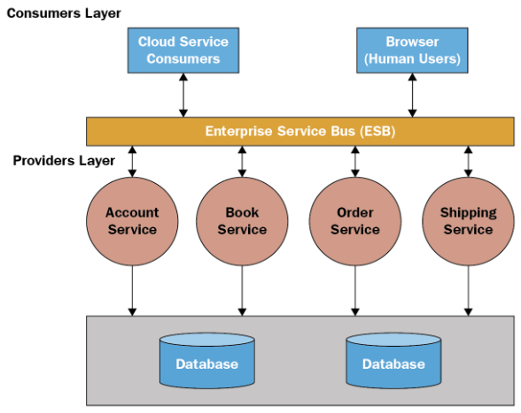
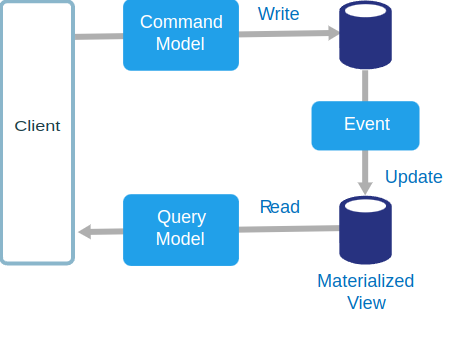
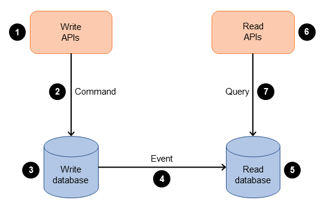
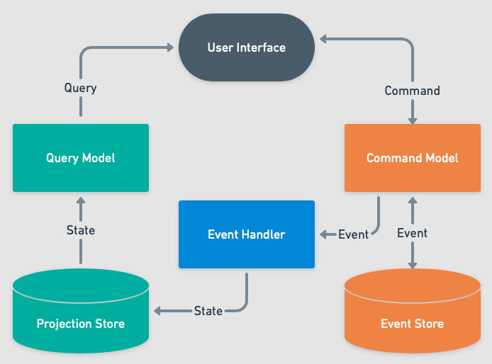

### Какие основные принципы лежат в основе архитектуры Model-View-Controller (MVC)?
1. **Модель (Model):** Это представление данных и бизнес-логики в бэкенд-части приложения. Модель содержит методы для работы с данными и обработки запросов, но не знает ничего о способе их представления пользователю.
    - *Хороший пример:* Класс или структура, представляющая объекты базы данных, и методы для выполнения операций CRUD (создание, чтение, обновление, удаление).
    - *Плохой пример:* Модель, которая содержит прямые вызовы к внешним сервисам или содержит код, отвечающий за форматирование данных для отображения.

2. **Представление (View):** Это форматирование данных, которые будут отправлены клиенту в ответ на запрос. В бэкенде представления могут быть представлены в виде JSON, HTML, XML и т. д.
    - *Хороший пример:* JSON-ответ, содержащий данные пользователя после успешного запроса на получение информации о пользователе.
    - *Плохой пример:* HTML-код, возвращаемый из метода контроллера, содержащий прямую вставку данных из базы данных.

3. **Контроллер (Controller):** Это посредник между моделью и представлением. Контроллер обрабатывает запросы от клиента, взаимодействует с моделью для получения необходимых данных и передает их в представление.
    - *Хороший пример:* Контроллер веб-приложения, который принимает HTTP-запрос, вызывает соответствующий метод модели для выполнения операции и возвращает результат в нужном формате.
    - *Плохой пример:* Контроллер, который содержит сложную логику обработки запроса, а также непосредственные вызовы к базе данных без использования модели.

### Какие преимущества и недостатки имеет монолитная архитектура приложений?
**Преимущества монолитной архитектуры:**

1. **Простота развертывания:** Монолитные приложения обычно проще развертывать, так как весь код находится в одном месте и не требует дополнительной конфигурации для запуска.

2. **Простота тестирования:** Поскольку все компоненты находятся в одном месте, тестирование монолита может быть более простым и эффективным.

3. **Производительность:** Внутри монолитного приложения вызовы функций и передача данных обычно происходят быстрее, чем в распределенной архитектуре.

4. **Простота разработки:** Разработка монолитного приложения может быть более простой из-за отсутствия необходимости управления межсервисными взаимодействиями.

5. **Простота масштабирования:** Монолиты могут масштабироваться вертикально (добавлением ресурсов на существующие серверы), что обычно проще и дешевле, чем горизонтальное масштабирование.

**Недостатки монолитной архитектуры:**

1. **Сложность поддержки:** С увеличением размера монолита и добавлением новой функциональности его поддержка и разработка могут стать сложными и медленными.

2. **Ограниченная масштабируемость:** Вертикальное масштабирование имеет свои ограничения, и в конечном итоге приложение может достичь предела своей производительности.

3. **Зависимости компонентов:** В монолитной архитектуре изменения в одной части приложения могут иметь непредвиденные последствия для других частей, так как компоненты часто сильно связаны друг с другом.

4. **Ограниченная гибкость:** Монолиты обычно менее гибкие, чем микросервисы, и могут оказаться неадаптивными к изменениям требований или технологическому прогрессу.

5. **Однопоточность:** Приложения с монолитной архитектурой могут страдать от однопоточности, что может привести к блокировкам и снижению производительности.

6. **Доступность и пользовательский опыт:** Монолитные приложения в случае отказа сервера или падения инстанса приложения, как правило полностью ограничивает доступ к ресурсу, там самым может нанести вред бизнесу из-за того что пользовательский опыт будет испорчен.

### Что такое микросервисная архитектура и какие преимущества и недостатки она имеет в сравнении с монолитной архитектурой?
**Микросервисная архитектура:**

Микросервисная архитектура – это подход к разработке программного обеспечения, при котором приложение разбивается на небольшие автономные сервисы, каждый из которых выполняет определенную функцию и взаимодействует с другими сервисами через API.

**Преимущества микросервисной архитектуры:**
1. **Гибкость и масштабируемость:** Микросервисы могут быть независимо развернуты, масштабированы и обновлены, что облегчает поддержку и развитие системы.
2. **Отказоустойчивость:** При отказе одного сервиса остальные продолжают работу, что уменьшает влияние отказов и обеспечивает более высокую доступность системы.
3. **Технологическое разнообразие:** Различные сервисы могут быть реализованы с использованием различных технологий, что позволяет выбирать наиболее подходящий инструмент для каждой конкретной задачи.
4. **Управление сложностью:** Разбиение приложения на небольшие сервисы упрощает его понимание и поддержку, так как каждый сервис имеет четко определенные обязанности.
5. **Быстрая разработка и поставка:** Микросервисы позволяют командам быстрее разрабатывать, тестировать и внедрять новый функционал, так как изменения в одном сервисе могут быть внесены независимо от других.

**Недостатки микросервисной архитектуры:**
1. **Сложность управления:** Управление большим количеством микросервисов требует более сложных инструментов и процессов, таких как мониторинг, логирование и координация обновлений.
2. **Сетевая сложность:** Передача данных между микросервисами через сеть может быть медленной и подвержена отказам, что может привести к задержкам и снижению производительности.
3. **Согласованность данных:** Согласование данных между различными сервисами может быть сложной задачей, особенно в случае распределенных транзакций или событий.
4. **Усложнение развертывания:** Развертывание микросервисной системы требует автоматизированных процессов и инструментов для обеспечения непрерывной поставки и отката изменений.

### Какие основные компоненты входят в архитектурный шаблон Event-Driven Architecture (EDA)?
Архитектурный шаблон Event-Driven Architecture (EDA) - это подход к построению распределенных систем, в котором основной упор делается на обработку событий, которые происходят в системе. В EDA система состоит из компонентов, которые реагируют на события, генерируемые другими компонентами, вместо того чтобы непосредственно взаимодействовать друг с другом.

Основные принципы EDA включают в себя асинхронную обработку событий, распределенную обработку данных, а также возможность создания слабосвязанных и гибких систем. Важными компонентами EDA являются источники событий, брокеры событий, потребители событий и обработчики событий.

Использование EDA позволяет разрабатывать системы, которые могут эффективно масштабироваться и адаптироваться к изменяющимся требованиям, таким образом повышая гибкость и отзывчивость системы.

Архитектурный шаблон Event-Driven Architecture (EDA) включает в себя следующие основные компоненты:

1. **События (Events):** Это ключевые сигналы или уведомления о важных изменениях в системе. События представляют собой абстракцию данных, которые передаются между различными компонентами системы.

2. **Источники событий (Event Sources):** Это компоненты или сервисы, которые генерируют события в системе. Источники событий могут включать в себя пользовательские действия, изменения в базе данных, внешние системы и т. д.

3. **Брокеры событий (Event Brokers):** Это промежуточные компоненты, которые принимают, обрабатывают и маршрутизируют события между различными компонентами системы. Брокеры событий обычно обеспечивают асинхронную коммуникацию между компонентами и поддерживают различные модели доставки сообщений, такие как Pub/Sub (публикация/подписка) и очереди сообщений.

4. **Потребители событий (Event Consumers):** Это компоненты или сервисы, которые подписываются на события, получаемые от брокера событий, и реагируют на них, выполняя определенные действия или обновляя состояние системы.

5. **Обработчики событий (Event Processors):** Это компоненты, которые выполняют обработку и анализ полученных событий, прежде чем передать их на дальнейшую обработку или ответную реакцию. Обработчики событий могут выполнять фильтрацию, преобразование, агрегацию или другие операции над событиями.

### Что такое Serverless архитектура и какие преимущества она предоставляет в разработке приложений?
Serverless архитектура - это методология разработки приложений, при которой разработчики могут сосредоточиться на написании кода приложения, не беспокоясь о управлении инфраструктурой, такой как серверы и вычислительные ресурсы. В рамках Serverless архитектуры, облачный провайдер (например, AWS Lambda, Azure Functions, Google Cloud Functions) берет на себя ответственность за масштабирование, управление и обслуживание серверов, а также за выделение вычислительных ресурсов для выполнения кода приложения.

Преимущества Serverless архитектуры:

1. **Упрощенная разработка**: Разработчики могут фокусироваться на написании бизнес-логики приложения, минимизируя заботы о конфигурации и управлении инфраструктурой.

2. **Масштабируемость**: Серверы автоматически масштабируются в зависимости от текущей нагрузки, что позволяет обеспечить высокую доступность и производительность приложения.

3. **Экономия ресурсов**: Платежи за использование Serverless сервисов обычно зависят от фактического времени выполнения кода и количества запросов, что может снизить общие операционные издержки.

4. **Быстрое развертывание**: Запуск и развертывание функций в Serverless окружении обычно занимает всего несколько минут, что позволяет быстро реагировать на изменения и обновления приложений.

5. **Высокая доступность**: Serverless платформы обычно обеспечивают высокую доступность благодаря автоматическому масштабированию и распределению нагрузки между несколькими серверами и зонами доступности.

6. **Отсутствие затрат на обслуживание**: За счет управления облачным провайдером инфраструктурой, команде разработчиков не требуется заботиться о обновлениях, управлении патчами и других задачах, связанных с обслуживанием серверов.

Хотя Serverless архитектура имеет множество преимуществ, она также имеет свои ограничения и не всегда подходит для всех типов приложений. Например, приложения с постоянной высокой нагрузкой могут оказаться дороже в использовании Serverless решений, чем традиционные методы хостинга. Кроме того, Serverless архитектура может ограничивать выбор языка программирования, доступные библиотеки и инструменты разработки.

### Какие принципы масштабирования и отказоустойчивости применяются в Serverless архитектуре?
В Serverless архитектуре применяются следующие принципы масштабирования и отказоустойчивости:

1. **Горизонтальное масштабирование**: Serverless платформы автоматически масштабируют вычислительные ресурсы горизонтально, позволяя обрабатывать увеличение нагрузки путем добавления или удаления экземпляров функций. Это обеспечивает способность приложения масштабироваться в зависимости от текущей нагрузки.

2. **Автоматическое масштабирование**: Облачные провайдеры Serverless предоставляют возможность автоматического масштабирования, что позволяет моментально реагировать на изменения нагрузки и динамически изменять количество экземпляров функций в зависимости от текущего спроса.

3. **Использование CDN и глобального распределения**: Для обеспечения высокой доступности и быстрого отклика, Serverless приложения могут использовать CDN (Content Delivery Network) для кэширования и распределения статических ресурсов. Это позволяет минимизировать задержки и обеспечить доступ к контенту из ближайшего к пользователю узла CDN.

4. **Резервирование ресурсов**: В Serverless архитектуре можно предварительно выделить ресурсы для обработки основной нагрузки, что позволяет гарантировать наличие ресурсов во времена пиковой нагрузки и предотвращает резкие колебания в производительности.

5. **Использование множества зон доступности**: Облачные провайдеры обычно обеспечивают возможность использования нескольких зон доступности для размещения вычислительных ресурсов. Это позволяет обеспечить высокую доступность и отказоустойчивость приложения путем распределения ресурсов по разным географическим областям.

6. **Мониторинг и управление ресурсами**: Serverless платформы обычно предоставляют инструменты мониторинга и управления ресурсами, которые позволяют отслеживать производительность приложения, обнаруживать и устранять узкие места, а также эффективно управлять выделенными ресурсами.

Применение этих принципов позволяет создавать Serverless приложения, которые обладают высокой отказоустойчивостью, масштабируемостью и производительностью, обеспечивая непрерывную работу приложения даже в условиях изменчивой нагрузки и возможных сбоев.

### Что такое Service-Oriented Architecture (SOA) и какие основные принципы лежат в основе?
Service-Oriented Architecture (SOA) - это архитектурный подход к проектированию и созданию программного обеспечения, который базируется на концепции сервисов. В рамках SOA приложение разбивается на независимые компоненты, которые называются сервисами. Каждый сервис предоставляет определенную функциональность и может взаимодействовать с другими сервисами через общие стандартизированные интерфейсы, например, веб-службы или API.

Основные характеристики SOA включают:

1. **Любой сервис может быть использован другими сервисами**: Каждый сервис может быть независимо создан, развернут и использован другими сервисами в системе.

2. **Слабая связанность и высокая свобода**: Сервисы могут изменяться и развиваться независимо друг от друга, что способствует гибкости и масштабируемости архитектуры.

3. **Повторное использование и компонентная модель разработки**: Поскольку каждый сервис предоставляет определенную функциональность, его можно повторно использовать в различных контекстах или в разных приложениях.

4. **Стандартизированные интерфейсы**: Сервисы обычно предоставляют стандартизированные интерфейсы для взаимодействия, что позволяет разным сервисам быть написанными на разных языках программирования и развернутыми на разных платформах.

5. **Легкость интеграции с внешними системами**: SOA обеспечивает простую интеграцию с внешними системами, так как внешние системы могут взаимодействовать с сервисами через стандартизированные интерфейсы.

Преимущества SOA включают улучшенную гибкость, масштабируемость и повторное использование кода, а также упрощенную интеграцию с внешними системами. Однако, внедрение SOA может быть сложным процессом, требующим тщательного планирования и управления.

### Что такое CQRS и в каких случаях его применение может быть полезным?
CQRS (Command Query Responsibility Segregation) - это архитектурный шаблон, который предлагает разделение операций чтения (query) и операций записи (command) в системе. В рамках CQRS команды и запросы обрабатываются разными компонентами приложения.

Применение CQRS может быть полезным в следующих случаях:

1. **Высокая нагрузка на чтение и запись**: Если ваша система испытывает высокую нагрузку на чтение и запись данных, разделение ответственности между службами чтения и записи может улучшить производительность, так как каждая служба может быть оптимизирована под свои конкретные потребности.

2. **Сложная логика представления данных**: Если у вас есть сложная логика представления данных, которая отличается от логики обновления данных, CQRS может помочь управлять этой сложностью, позволяя каждой части системы сосредоточиться на своей специализированной задаче.

3. **Распределенные системы**: В распределенных системах, где различные компоненты могут быть развернуты на разных узлах сети, использование CQRS может упростить взаимодействие между этими компонентами, разделяя операции чтения и записи на уровне сети.

4. **Событийно-ориентированные системы**: CQRS хорошо сочетается с событийно-ориентированным подходом к разработке, так как операции записи могут порождать события, которые затем могут быть обработаны службой чтения для обновления представления данных.

5. **Управление состоянием**: В системах, где управление состоянием является важной частью функциональности, CQRS может помочь разделить ответственность за управление состоянием и запросами о состоянии, что улучшает читаемость и поддерживаемость кода.

### Какие принципы разделения операций чтения и записи применяются в паттерне CQRS?
Принципы разделения операций чтения и записи в паттерне CQRS основаны на следующих принципах:

1. **Разделение ответственности**: Операции чтения и записи разделяются между разными компонентами системы. Компоненты, отвечающие за чтение, специализируются на предоставлении данных для представления пользователю, в то время как компоненты, отвечающие за запись, обрабатывают команды на изменение состояния системы.

2. **Однонаправленный поток данных**: В CQRS данные потоки идут в одном направлении: от пользовательского интерфейса к службам записи и от хранилищ данных к службам чтения. Это облегчает понимание и управление потоком данных в системе.

3. **Синхронизация данных по требованию**: Данные между службами чтения и записи могут быть синхронизированы по требованию, например, с помощью событийной модели или фоновых задач. Это позволяет обновлять данные в представлениях только при необходимости и обеспечивает лучшую производительность системы.

4. **Разные модели данных**: Чаще всего, для операций чтения и записи используются разные модели данных. Модель данных для чтения оптимизирована для запросов на чтение и обеспечивает быстрый доступ к данным для представления пользователю, в то время как модель данных для записи может быть оптимизирована для обработки команд и обновления состояния системы.

5. **Упрощение и облегчение масштабирования**: Разделение операций чтения и записи облегчает масштабирование системы. Компоненты, отвечающие за чтение, могут быть масштабированы независимо от компонентов, отвечающих за запись, что позволяет лучше справляться с высокими нагрузками на чтение и запись.

### Что такое Event Sourcing и какие преимущества он предоставляет при разработке систем?
Event Sourcing (история событий) - это паттерн проектирования, который заключается в том, чтобы сохранять состояние приложения, записывая все изменения состояния как события в журнале событий. Вместо того чтобы хранить текущее состояние объектов, система сохраняет историю всех событий, которые произошли с объектами, и восстанавливает текущее состояние путем повторного применения всех событий из истории.

Преимущества Event Sourcing включают:

1. **История изменений**: Event Sourcing сохраняет историю всех изменений состояния системы, что позволяет анализировать, отслеживать и восстанавливать состояние системы на любой момент времени.

2. **Аудит и отслеживаемость**: Благодаря хранению истории событий, Event Sourcing обеспечивает возможность аудита и отслеживаемости всех изменений состояния системы, что полезно для обеспечения соответствия требованиям безопасности и правилам бизнеса.

3. **Отмена и повторение операций**: Поскольку все изменения сохраняются как события, можно легко отменить или повторить операции, применив или откатывая события в журнале.

4. **Повышенная надежность и восстановление после сбоев**: Используя Event Sourcing, можно легко восстановить состояние системы после сбоя, просто повторив все события из журнала.

5. **Масштабируемость**: Event Sourcing позволяет легко масштабировать систему горизонтально, так как каждый агрегат (объект) может обрабатываться независимо от остальных, а история событий может быть сохранена в распределенном хранилище.

6. **Поддержка сложной бизнес-логики**: Event Sourcing позволяет легко реализовывать сложную бизнес-логику, поскольку состояние системы может быть построено на основе истории событий.

### Какие механизмы общения между сервисами используются в микросервисной архитектуре?
В микросервисной архитектуре для общения между сервисами используются различные механизмы, включая:

1. **HTTP/HTTPS API**: Многие микросервисы предоставляют HTTP/HTTPS API для взаимодействия с другими сервисами. Это может быть RESTful API, GraphQL или любой другой HTTP-протокол.

2. **Message Queues (очереди сообщений)**: Сервисы могут использовать асинхронные сообщения для обмена данными и выполнения задач. Это может быть реализовано с помощью очередей сообщений, таких как RabbitMQ, Apache Kafka, Amazon SQS и других.

3. **gRPC**: gRPC - это сетевой фреймворк, разработанный Google, который позволяет создавать удаленные процедурные вызовы (RPC) между различными сервисами. Он использует протокол HTTP/2 для обмена данными и поддерживает сериализацию в формате Protocol Buffers.

4. **Event Streaming (потоковая передача событий)**: Этот механизм предполагает передачу потоков данных в реальном времени между сервисами. Примеры инструментов для реализации event streaming включают Apache Kafka, Amazon Kinesis и другие.

5. **Service Discovery (обнаружение сервисов)**: Для поиска и связывания с другими сервисами используются инструменты обнаружения сервисов, такие как Consul, Etcd, Zookeeper, а также встроенные решения в облачных платформах (например, AWS Cloud Map, Azure Service Fabric).

6. **GraphQL**: GraphQL - это язык запросов для вашего API, который позволяет клиентам запрашивать только те данные, которые им нужны. Это может быть полезным в микросервисной архитектуре, где клиентам требуется получать данные из разных сервисов.

7. **Remote Procedure Calls (RPC)**: Этот механизм предполагает вызов удаленных процедур для выполнения операций в других сервисах. Он может быть реализован с использованием различных протоколов, таких как gRPC, Thrift, Apache Avro и другие.

### Какие принципы безопасности следует учитывать при разработке микросервисной архитектуры?
При разработке микросервисной архитектуры следует учитывать следующие принципы безопасности:

1. **Аутентификация (Authentication)**: Обеспечение уникальной идентификации пользователей и сервисов. Для этого можно использовать методы аутентификации, такие как JWT, OAuth, OpenID Connect и другие.

2. **Авторизация (Authorization)**: Управление правами доступа к ресурсам и операциям. Необходимо определить, кто имеет доступ к каким данным и функциональности, и обеспечить соответствующие разрешения.

3. **Шифрование (Encryption)**: Защита данных в пути и в покое с помощью шифрования. Для этого можно использовать TLS/SSL для защищенной передачи данных по сети и шифрование данных в хранилищах.

4. **Проверка безопасности сторонних компонентов (Third-party Component Security)**: Обеспечение безопасности сторонних библиотек, фреймворков и сервисов, которые используются в микросервисах. Важно следить за их обновлениями и исправлениями уязвимостей.

5. **Мониторинг и регистрация событий (Monitoring and Logging)**: Ведение журналов и мониторинг операций с целью обнаружения и реагирования на потенциальные угрозы безопасности, а также анализа инцидентов безопасности.

6. **Защита от инъекций (Injection Protection)**: Предотвращение атак внедрения кода, таких как SQL-инъекции, XSS-атаки и другие. Это может быть достигнуто с помощью использования параметризованных запросов, фильтрации ввода и вывода и других методов.

7. **Отказоустойчивость (Resilience)**: Разработка микросервисов с учетом обработки ошибок и восстановления после сбоев для минимизации воздействия атак и сбоев на систему в целом.

8. **Обновление безопасности (Security Patching)**: Регулярное обновление и патчинг компонентов системы для устранения уязвимостей и обеспечения безопасности.

9. **Доступность (Availability)**: Обеспечение доступности системы при атаках и нагрузках. Это включает в себя меры по предотвращению отказа обслуживания (DDoS), управлению нагрузкой и масштабированию инфраструктуры.

10. **Безопасность данных в покое и в движении (Data Security)**: Защита данных во время их передачи по сети и хранения на серверах. Это может быть достигнуто с помощью шифрования данных, управления ключами и других методов.
