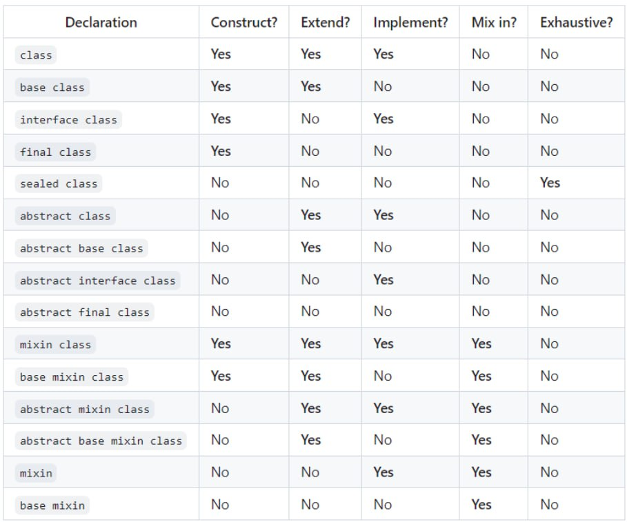

## Знания основ языка Dart
---

### Что такое язык программирования Dart?
**Ответ:** Это объектно-ориентированный язык программирования, разработанный Google, который используется для создания веб-приложений, мобильных, десктоп приложений, может работать в качестве серверного приложения.

### Какие виды компиляции поддерживает Dart ?
**Ответ:** Dart поддерживает как JIT-компиляцию (Just-in-Time), так и AOT-компиляцию (Ahead-of-Time).

### Чем отличается JIT-компиляция от AOT-компиляция?
**Ответ:** JIT-компиляция происходит во время выполнения программы, компилируя код по мере его необходимости, что позволяет быстро запускать приложение и упрощает процесс разработки. 
AOT-компиляция, происходит до запуска программы, что обеспечивает быструю загрузку приложения и более эффективное использование ресурсов, но может увеличить время разработки из-за необходимости повторной компиляции при изменениях.

### Что такое null safety в Dart?
**Ответ:** Null safety в Dart - позволяет разработчикам более безопасно работать с нулевыми значениями (null). Система null safety позволяет указывать, может ли переменная содержать значение null или нет, что помогает избежать ошибок связанных с нулевыми ссылками во время выполнения программы. 

### Как объявить переменную в Dart?
**Ответ:** Переменную можно объявить с использованием ключевого слова var, final или dynamic.

### В чем отличие между var, final или dynamic ? 
**Ответ:** 
var:
    Используется для объявления переменных без явного указания типа.
    Тип переменной автоматически выводится из инициализатора.
    Может быть изменена после объявления.
final:
    Используется для объявления неизменяемых переменных.
    Тип переменной должен быть явным.
    Может быть инициализирована при объявлении или позже.
dynamic:
    Используется для отключения проверки типов.
    Переменная может хранить значение любого типа.

### Какие преимущества имеет использование асинхронного программирования в Dart?
**Ответ:** Асинхронное программирование позволяет эффективно использовать ресурсы устройства, такие как процессорное время и память, улучшая отзывчивость приложения.

### Какие типы переменных можно объявлять в Dart, и какие ключевые слова для этого используются?
**Ответ:** В Dart можно объявлять переменные с явным указанием типа (используя ключевое слово var или указание типа), а также переменные с неявным типом (используя ключевое слово dynamic). Ключевое слово final используется для объявления неизменяемых переменных с явным указанием типа.

### Что такое типизация переменных в Dart, и какие типы типизации поддерживает этот язык?
**Ответ:** Типизация переменных в Dart означает указание типа данных переменной. Dart поддерживает строгую статическую типизацию, что означает, что тип переменной определяется на этапе компиляции и не может измениться во время выполнения программы. Дарт также поддерживает типизацию с использованием типа dynamic, который позволяет переменной принимать значения любого типа данных.

### Как работает механизм сокрытия методов в классе, самих классов в Dart?
**Ответ:** Если в названии метода или класса в начале указан символ подчеркивания то эти методы и классы будут доступны в рамках пакета(файла, нескольких файлов объединенных в части - part) и не доступны снаружи в том числе и при наследовании классов.

### Как объявить и использовать циклы в Dart, какие циклы бывают?
**Ответ:** В Dart доступны следующие виды циклов:
Цикл while: while (условие) { ... }
Цикл do-while: do { ... } while (условие);
Цикл for: for (инициализация; условие; обновление) { ... }
Цикл for-in: for (элемент in коллекция) { ... }

### Каким образом реализуется наследование в Dart, и какие ключевые слова используются для этого?
**Ответ:** В Dart наследование реализуется путем расширения класса. Дочерний класс наследует свойства и методы родительского класса с помощью ключевого слова extends.

### Что такое конструкторы в Dart, какие бывают, и как они используются при создании экземпляров классов?
Конструкторы в Dart - это специальные методы класса, используемые для создания экземпляров классов. Бывают:
Конструктор по умолчанию: Dart автоматически создает конструктор по умолчанию, если он не был явно определен.
Именованный конструктор: Позволяет создавать несколько конструкторов с разными именами.
Конструктор инициализации: Используется для инициализации полей класса при создании экземпляра.

### Какие модификаторы классов имеются в Dart версии 3 и выше ? Что позволяют делать ?
**Ответ:**

### Как работает механизм исключений (Exceptions) в Dart, и как их можно обрабатывать?
**Ответ:**В Dart исключения представлены классами, наследующими класс Exception. Для обработки исключений используется конструкция try-catch. Код, который может вызвать исключение, помещается в блок try, а код обработки исключения - в блок catch. После блока catch может следовать блок finally, который будет выполнен в любом случае, даже если исключение не было перехвачено.

